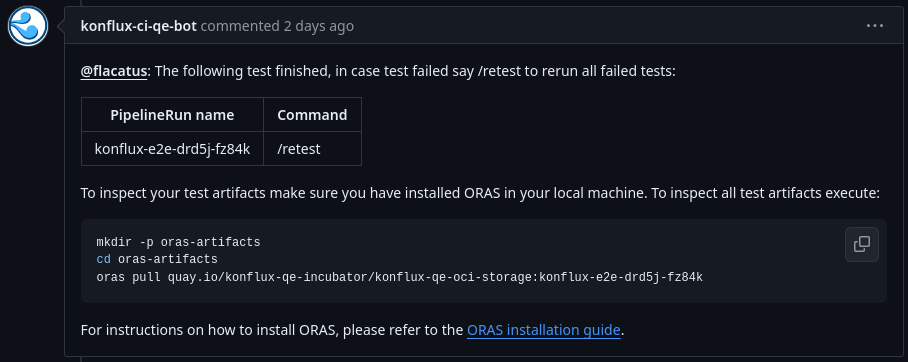

# ORAS (Open Repository of Artifacts Specification)

[**ORAS** (Open Repository of Artifacts Specification)](https://oras.land) is a project aimed at standardizing the way container images and other artifacts are stored and accessed in container registries. It provides a unified way to manage and interact with artifacts, extending beyond traditional container images to include various types of artifacts used in software development and deployment pipelines.

## Key Features of ORAS

- **Artifact Types**: ORAS supports storing various types of artifacts beyond Docker images, such as Helm charts, JAR files, tarballs, and more. This flexibility allows teams to manage all their artifacts in one place.
- **Compatibility**: ORAS is compatible with multiple container registries, including Docker Registry, Azure Container Registry, Google Container Registry, and others. It ensures interoperability across different cloud providers and private registry solutions.
- **Metadata Management**: ORAS allows storing and retrieving metadata alongside artifacts. This metadata can include versioning information, dependencies, and other contextual details crucial for artifact management.

## Benefits of Using ORAS

- **Centralized Artifact Management**: ORAS centralizes artifact storage, simplifying artifact discovery and retrieval across development teams and environments.
- **Improved CI/CD Pipelines**: By securely storing artifacts in ORAS, CI/CD pipelines can seamlessly access and deploy artifacts, accelerating software delivery cycles.
- **Compliance and Governance**: ORAS supports compliance requirements by providing audit trails, access controls, and metadata management capabilities essential for regulatory compliance.

## How to Set Up ORAS in Konflux

To set up an ORAS container to use in your integration test pipeline, you need to execute the `test-metadata` task to generate all necessary metadata:

```yaml
apiVersion: tekton.dev/v1beta1
kind: Pipeline
metadata:
  name: test-metadata-pipeline
spec:
  tasks:
    - name: extract-metadata
      taskRef:
        resolver: git
        params:
          - name: url
            value: https://github.com/konflux-qe-incubator/konflux-qe-definitions
          - name: revision
            value: main
          - name: pathInRepo
            value: common/tasks/test-metadata/test-metadata.yaml
      params:
        - name: SNAPSHOT
          value: "<your-snapshot-json>"
        - name: test-name
          value: "<your-test-name>"
        - name: oras-container
          value: <your-container-registry> # quay.io/example-user-org/container-name
```

The task will generate as a result your OCI container in the following format: <oras-container-name>:$pipelinerun-name. Will use your pipeline run as unique tag to push to registry.

Example of usages:

```bash
# Login to registry
oras login -u "$ORAS_USERNAME" -p "$ORAS_PASSWORD" quay.io

# Pushing artifacts to registry. ARTIFACT_DIR mean that all artifacts found in that dir will be pushed
oras push <oras-container>:<oras-container-tag> \
    --config config.json:application/vnd.acme.rocket.config.v1+json \
    $ARTIFACT_DIR/:application/vnd.acme.rocket.docs.layer.v1+tar
```

The output when a test finalize is the following:



